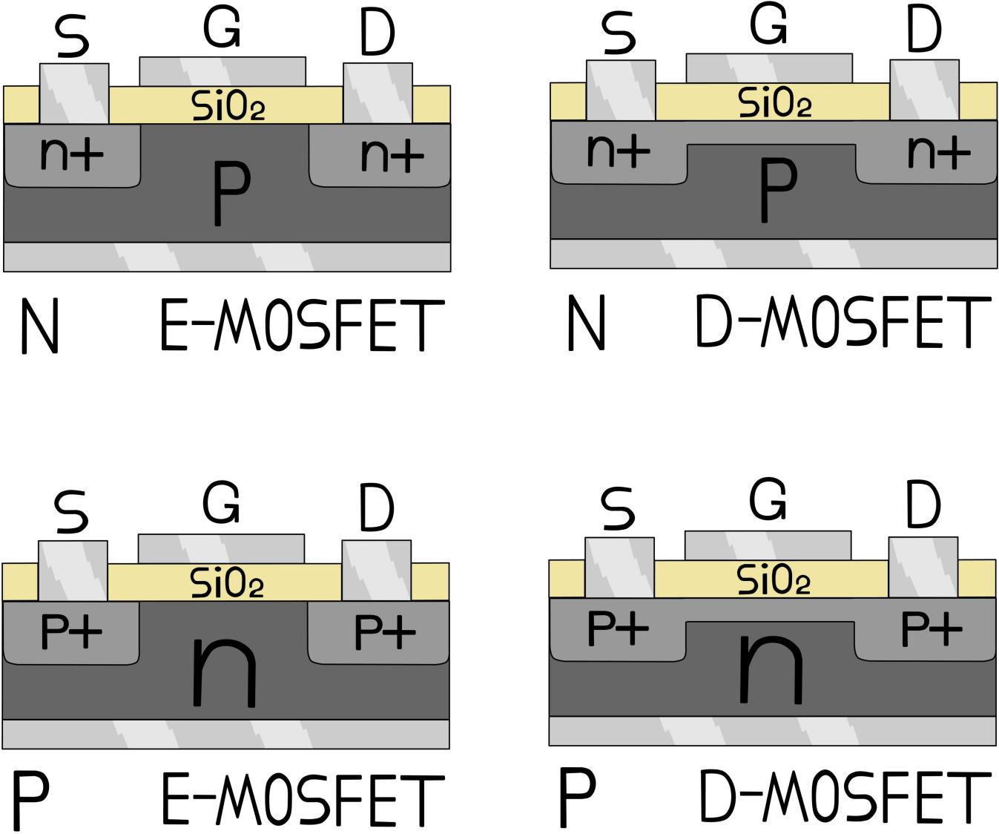
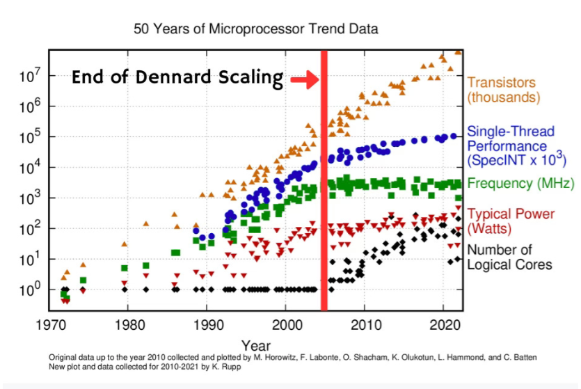
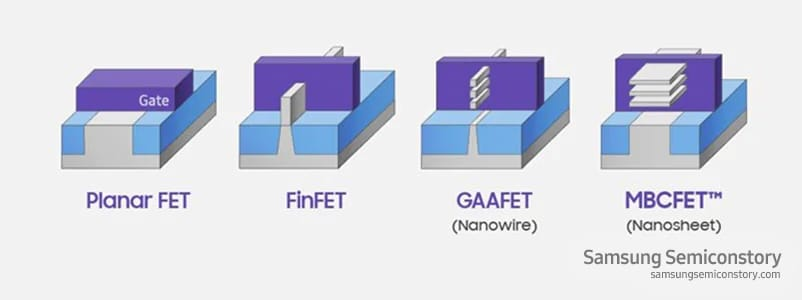
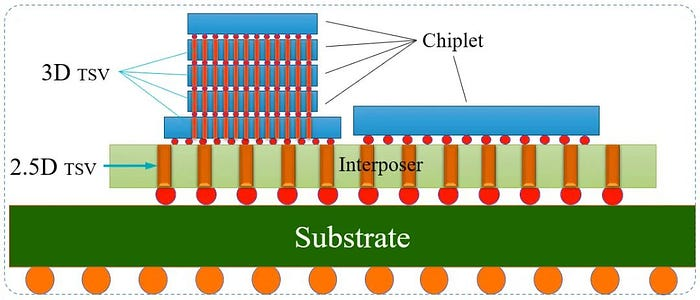
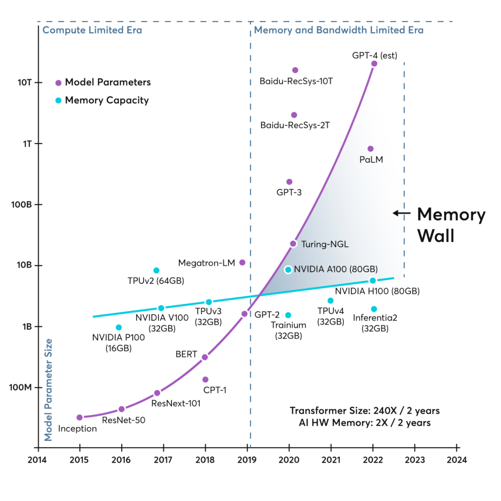
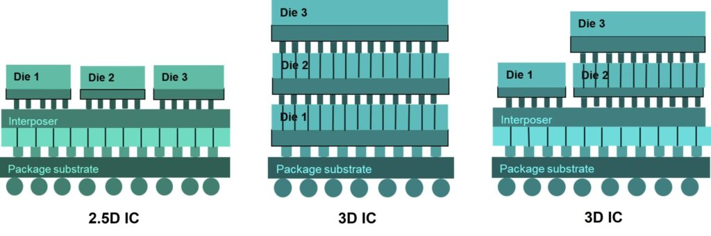

# 不只看“几纳米”：华为“韬（τ）定律”到底重构了什么？

　　——纳米神话的终结、系统工程的升维与中国半导体的破局之战

　　*阅读提示：本文约12000字，阅读大约需要半小时。它尝试回答一个问题：**当芯片制程逼近物理极限，华为提出的“韬定律”是突围宣言，还是产业规则的重新定义？**如果你对芯片的认知停留在“几纳米”，建议从第一部分的科普开始；如果你只关心产业博弈和战略逻辑，可以直接跳至第五部分。*

　　2026年5月，在国际电路与系统研讨会（ISCAS 2026）的上华为向全球抛出了一枚震撼整个产业界的重磅炸弹：发布半导体产业演进的全新理论框架——**“韬（τ）定律”**。

　　这不仅是华为在极紫外光刻机（EUV）受限条件下的突围宣言，更是向统治了全球半导体六十年的“唯制程论”发出的终结信号。这意味着，**半导体产业正式跨越了单点微缩的旧时代，迈入系统级重构的新范式。**在过去的六年里，华为默默设计并量产了381款芯片。这些横跨移动通信、AI、汽车和基础设施的芯片，向统治了全球半导体整整六十年的“唯制程论”发出了最强烈的叩问：**当单纯追求晶体管物理尺寸微缩的红利被吃干榨净，我们是否还要在别人划定的“纳米赛道”上被继续吸血？**

　　要想理解这场掀翻桌子的底层重构，我们必须先用冷峻的物理学视角，去戳破那个笼罩在消费者头顶的“纳米神话”。

# 一、祛魅“摩尔定律”与“纳米神话”的终结

　　今天，当你走进数码门店，销售员可能会把“搭载最新3纳米芯片”挂在嘴边。仿佛这个数字越小，芯片就越拥有魔法。但在资深的芯片工程师眼里，这条单边狂奔的黄金赛道，早已布满裂痕。

## （一）核心概念：芯片与制程

　　要理解什么是摩尔定律，就要理解芯片是什么？为什么要追求更好的制程工艺？所谓的“3纳米”到底是什么？

　　**芯片的正式学名叫集成电路**（Integrated Circuit，简称IC）。

　　如果打个比方，它就像是一座建在微观世界里的“超级城市”。工程师利用光刻技术，将数以百亿计的极其微小的电子元件（主要是晶体管，此外还有电阻、电容等），像印花一样密密麻麻地雕刻在一块指甲盖大小的半导体（通常是硅）薄片上，并用极细的金属线将它们连接起来。

　　**芯片的目标是处理、存储和交互由电信号（0和1）代表的信息。**

　　如果把各式电子设备比作“人”，芯片可以按照用途划分大致分为以下四大类：

　　①　逻辑与计算芯片（相当于人的大脑）：这就是“逻辑运算”。它们是设备的核心指挥官和运算主力。典型代表：CPU（中央处理器）、GPU（图形处理器），以及现在爆火的NPU（专门算AI的神经网络处理器）。它们负责做数学题、执行软件指令、做条件判断。

　　②　存储芯片（相当于人的记忆）：大脑算得再快，也需要地方把数据记下来。典型代表：内存（DRAM，决定你能同时开多少个App不卡）和闪存（NAND Flash，就是你手机的256GB或1TB存储空间）。

　　③　模拟与传感芯片（相当于人的五官和消化系统）：现实世界是“连续的”（光线的渐变、声音的起伏），但逻辑运算只认识干脆利落的“0和1”。这类芯片负责把现实世界翻译成数字世界。典型代表：手机摄像头的图像传感器（CIS，充当眼睛）、音频芯片（充当耳朵），以及负责控制电压分配的电源管理芯片（充当消化系统供能）。

　　④　通信与射频芯片（相当于人的嘴巴和耳朵）：负责让设备能够对外交流。典型代表：5G基带芯片、Wi－Fi芯片、蓝牙芯片。

　　逻辑运算如此重要，它是怎么在物理层面上发生的呢？答案就是化身为“开关”：**晶体管在数字芯片中，扮演的就是一个电控开关。接通电流，代表数字1；断开电流，代表数字0。**

　　组建“逻辑门”：

　　①　与门（AND）：把两个开关串联在电线上。只有当开关A和开关B都闭合（都是1）时，电流才能通过。这代表了逻辑上的“并且”。

　　②　或门（OR）：把两个开关并联。只要开关A或开关B有一个闭合（其中一个是1），电流就能通过。这代表了逻辑上的“或者”。

　　③　非门（NOT）：输入1，输出0；输入0，输出1。代表逻辑上的“否定”。

　　工程师通过将几个开关巧妙地串联或并联，就能实现基础的逻辑判断。数学家和计算机科学家早就证明了：**只要你拥有足够多、足够密集的“与、或、非”逻辑门，你就能组合出加法器、乘法器，就能完成世界上所有的微积分，运行复杂的操作系统，甚至是训练出顶级的AI大模型**。

　　所以，当一块采用先进制程的芯片全速运转时，它的内部其实是几百亿个微小的开关，在以每秒几十亿次的速度疯狂地开和关（这就是芯片主频的物理含义），从而完成了海量的逻辑运算。

## （二）摩尔定律的真实面貌

　　1965年4月19日，当时还在仙童半导体公司任研发主任的戈登·摩尔，应《电子学》（Electronics）杂志的邀请，写了一篇题为《将更多组件塞入集成电路》的短文。

　　在这篇文章中，他基于此前几年集成电路的发展数据，提出了那段著名的观察：“**在最低元件成本下的复杂性（即单个芯片上的晶体管数量），每年大约增加一倍。短期内，这一增长率有望继续。即便长远来看，这一增长率即使不保持恒定，至少在未来十年内，也没有理由相信它会放缓。”**

　　重点是：摩尔最初的观察是“每年”翻一倍，而且他加了一个关键的前提——“**在最低元件成本下**”。也就是说，这不是纯粹的物理极限挑战，而是一个**经济学规律**：只有当芯片变复杂的同时，单个晶体管的成本还在不断下降，这个翻倍才有商业意义。

　　但真正让摩尔定律拥有物理学灵魂的，是1974年提出的“登纳德缩放定律（Dennard Scaling）”。

　　登纳德缩放定律，是由罗伯特·登纳德（Robert Dennard）等人在 1974 年提出的一个核心经验法则。登纳德缩放定律给出了可物理实现的路径：**当晶体管尺寸缩小到原来的0.7倍（面积减半），电压和电流也按比例降低，使得功率密度保持不变。这样一来，晶体管数量翻倍的同时，芯片的功耗基本不变，频率能提升约40％。**正是这种“尺寸缩小→电压降低→功耗密度不变→性能持续攀升”的连锁关系，让摩尔定律从一条简单的经验规律，变成了一场持续数十年的物理工程革命。正是这个完美的公式，让当年的电脑CPU频率一路狂飙。

　　1975年，摩尔已经与罗伯特·诺伊斯共同创立了英特尔。在当年的IEEE国际电子器件会议（IEDM）上，摩尔提交了一篇论文，对当初的预测进行了复盘。他发现，由于芯片变得越来越复杂，物理尺寸缩小的难度变大，原来的增长速度已经无法维持了。他亲自修正了自己的预言：“**集成电路的复杂度大概是每两年翻一倍，而不是每年。”**

## （三）那制程节点所谓的纳米到底是什么？

　　在传统的二维平面时代（也就是被称为“平面晶体管”或Planar FET时代），“90纳米”这类数字有着极其严谨的物理对应关系。

　　要理解它，我们需要先了解晶体管最基础的四个部分：

- 源极（Source）：电子出发的地方。
- 漏极（Drain）：电子到达的目的地。
- 沟道（Channel）：连接源极和漏极之间的“公路”。
- 栅极（Gate）：悬在沟道上方的“红绿灯”或“水龙头开关”。

　　当栅极通电时，沟道打开，电子流过去（代表1）；栅极断电时，沟道关闭，电子被拦住（代表0）。

　　*图1：形象化示意图*

　　在当时，“90纳米”通常指的就是“栅极长度（Gate Length）”，也就是源极和漏极之间的物理距离。

　　栅极长度越短，电子跑过去所需的时间就越少，开关速度就越快，芯片性能就越高。同时，单个晶体管变小了，单位面积内能塞进去的晶体管就越多，密度就上去了。在0.13微米及更早的时代，诸如“90nm”大致对应着晶体管的物理栅极长度。但随着应变硅、高K金属栅等技术的引入，从45nm节点起，这个数字便逐渐脱离真实的物理尺寸，演变为一个营销化的性能等效标签。

　　到了2005年左右，这个完美公式崩溃了。随着晶体管的绝缘层被做得只剩下几个原子厚，微观世界的“量子隧穿效应”如同幽灵般出现——电子直接无视绝缘层穿墙而过，造成极其严重的漏电。为了按住漏电，工程师再也无法按比例降低电压了。**当栅极长度（以及栅极下方的绝缘氧化层）薄到5纳米甚至3纳米的原子级别时，经典物理学规律开始失效，量子力学效应占据主导。**

　　**“穿墙术”与漏电**：正常情况下，当栅极关闭时，电子应该乖乖停在源极。**但在3纳米的尺度下，因为距离太近了，电子会发生量子隧穿效应。**它们会直接无视物理屏障，“瞬移”穿过关闭的沟道或绝缘层，跑到漏极去。

　　**芯片熔毁或失效**：这种现象在宏观上的表现就是极度严重的漏电流。这意味着晶体管即使在“关闭”状态下也在疯狂耗电并发热。芯片不仅无法实现清晰的“0”和“1”的开关控制（逻辑混乱），还会**因为巨大的漏电流产生的高温而直接烧毁**。

## （四）“暗硅时代”的残酷现实

　　电压降不下来，晶体管却越塞越多，直接催生了半导体行业极其残酷的“暗硅时代”。

　　现在的芯片就像一座拥有几百亿栋大楼的超级城市。虽然我们能把这么多大楼塞进这座城市，但城市的总发电量和散热能力是有限的。在任何一个瞬间，你只能点亮城市里10％到20％的大楼进行工作，剩下80％的区域必须保持黑暗休眠。否则，整颗芯片就会因为热量无法散出而在瞬间熔毁。

*图2：登纳德缩放定律（Dennard Scaling）的失效与功耗墙的到来。2005年后，时钟频率与单核性能增长停滞，行业被迫转向多核设计，暗硅时代正式降临。*

　　所谓的“3纳米”是一个充满了妥协和文字游戏的说法。代工厂的潜台词其实是：“如果物理定律（比如量子隧穿）不存在，让传统2D晶体管完美缩小到3纳米，它大概能达到某个性能和密度。虽然现实中2D晶体管做不到，但我们换了一种全新的3D物理结构，把性能拔高到那个理论水平，所以我们把它命名为3nm制程。”

　　量子隧穿和漏电问题，目前业界在物理结构上已经做出了巨大的改变：

　　放弃了平面的2D结构，把沟道“立”了起来，做成类似鱼鳍的形状，让栅极从三面包裹住沟道（这叫FinFET鳍式晶体管）。

　　*图3：为了对抗漏电，晶体管早已从2D平面转向3D立体架构。来源：Samsung Semiconductor*

　　到3nm节点，三星率先将沟道做成纳米片、引入GAAFET（全包围栅极），而台积电在FinFET上继续精进；到了2nm，主流才全面拥抱GAAFET，让栅极从四面八方死死包裹住沟道，以此来最大程度地增强对电子的控制力，强行按住想要“隧穿”的电子。

　　现在大家还都在叫“3纳米”“2纳米”，背后主要是两股力量在博弈：

### ①营销部门战胜了技术部门

　　芯片代工厂（如台积电和三星）之间存在着极其残酷的商业竞争。每一个新世代的工艺推出，营销团队都需要一个最简单、最粗暴、最能刺激客户眼球的标签去抢夺订单。

　　如果台积电宣布推出了“3纳米工艺”，而三星宣布推出了“等效3纳米工艺”，在不明真相的消费大众和普通投资者眼里，听起来就像是三星的技术“落后”或者“不纯正”一样。结果就是，大家一起卷入了这个数字游戏，把“等效”两个字心照不宣地省去了。

　　在商业维度上，消费者需要一个“极简指标”：在消费电子市场（手机、电脑），大众消费者是不懂复杂的底层架构和物理学的。他们需要一个像手机“像素”一样直观、粗暴且容易攀比的数字指标。“3比5小，所以3比5好”——这种极低的认知门槛，是科技巨头们（苹果、高通、台积电）进行全球营销的锋利武器。如果台积电突然跟大众科普说“我们这是基于GAA架构的等效密度提升工艺”，消费者大概率会一头雾水，甚至不愿买单。

### ②行业曾试图拨乱反正，但失败了

　　行业巨头其实真的认真尝试推行过：如英特尔的改名风波：几年前，英特尔的工艺在物理密度上其实一直比台积电更严格。英特尔的“10纳米”晶体管密度，直逼台积电的“7纳米”。这导致英特尔在营销上吃了大亏。于是，英特尔后来直接放弃了单纯的纳米命名，改用Intel 7、Intel 4、Intel 20A这样的代号，试图把公众的注意力从“物理纳米数”转移到“代际代号”上。

　　学者呼吁用“密度”命名：国际半导体技术路线图（ITRS）组织曾多次建议，应该废除纳米命名法，改用GMT命名法（Gate pitch，Metal pitch，Tiers），或者直接用每平方毫米有多少百万个晶体管（MTr／mm²）来定义。

## （五）工程维度：工程师真正看重的“PPA”

　　在半导体公司内部，工程师们评估一种新工艺或新架构时，看一个被称为PPA的核心铁三角标准：

- Performance（性能）：晶体管开关速度有多快？芯片主频能飙到多高？
- Power（功耗）：在达到相同性能时，漏电率是多少？耗电大不大？发热严不严重？
- Area（面积／密度）：每平方毫米到底能实打实地塞进去多少百万个晶体管（MTr／mm²）？

　　只要一家代工厂做出的芯片，在PPA这三个维度上击败了上一代，营销部门也敢把它叫作“下一代纳米制程”。

## （六）被锁死的经济学账本

　　除了物理极限，摩尔定律作为一条经济学规律，也已经破产。过去，晶体管越小，单个晶体管的成本就越低。但在最先进的节点上，制造极紫外光刻机（EUV）的折旧成本主导了晶圆成本，尖端芯片的设计预算动辄超过十亿美元。**在最先进节点上，单个晶体管的成本不仅停止了下降，甚至开始触底反弹**。

　　当“空间微缩”不仅在物理上撞到了叹息之墙，在经济上也沦为资本的绞肉机，业界寻找新路径已成生死之战。

# 二、“韬定律”的工程学解法：从“空间”转向“时间”

　　华为的破局思路是极其典型的**“第一性原理”**：**我们把芯片做小的终极目标到底是什么？不是为了显微镜下的视觉奇观，而是为了压缩时间（延迟）**。如果你想知道这是不是吹牛，我们来看一下它是怎么做到的。

　　在极复杂的微观电路中，决定计算速度的咽喉，是**时间常数τ＝RC**。在7纳米以下节点，晶体管本身的开关速度虽然快，但连接它们的极细局部互连线所带来的阻容延迟（RC延迟），成了扼杀性能的元凶。

　　如果说晶体管是高楼，互连线是马路。大家拼命把芯片做小（几何微缩），导致马路被迫做得比头发丝还细几万倍（电阻R暴增）；同时，几百亿条线路密密麻麻挤在一起，互相产生严重的电磁干扰（电容C暴增）。结果就是：虽然高楼之间的绝对距离近了，但因为马路太窄、干扰太大，送快递（传输信号）的时间反而变长了！

　　既然平面上的路堵死了，华为正式提出以“时间微缩”**替代几何微缩的**“韬（τ）定律”。

　　在架构演进中，这具有严谨的数学指导：

$$τ_{n+1}=\frac{τ_{n}}{α}$$

　　*在这里，α是缩放因子。在受功耗严格限制的手机设备中，α约为1.3；而在算力极其饥渴的AI集群中，α可高达10（即吞吐量提升十倍）。*

　　如果说“等效3纳米”是一个充满了妥协、试图掩盖物理极限的“营销代名词”；那么“时间缩微”就是一个坦诚面对物理现实、基于整体系统效能（计算、互联、存储、软件协同）的“工程代名词”。**它标志着芯片的竞争，正式从“单一器件的微观雕刻比赛”，走向了“宏观系统工程的统筹比赛”。**

　　这绝不是对摩尔定律的简单缝补，而是一场视角的降维打击：**不再死磕单一晶体管的尺寸，而是将器件、电路、芯片、封装、互连和系统的全栈时间压缩，作为新的统一终极标尺**。

　　为了实现这一目标，华为构建了三大技术支撑：

　　①　物理层的“**逻辑折叠**”：放弃在 2D 平面上的死磕，向三维空间要效益。通过 3D 堆叠技术，将原本铺在同一平面的电路折叠成多层。垂直的立体互连（如 TSV 硅通孔）取代了漫长的平面布线，真实地降低了数据传输的物理耗时。

　　②　架构层的“**全栈软硬协同**”：打破传统的软硬件壁垒，基于实际工作负载对指令流和数据流进行细粒度控制，用更高的系统并行度来缩减端到端的执行时间。

　　③　系统层的“**灵衢总线**”：在超大节点内实现统一内存编址。这直接打破了困扰冯·诺依曼架构数十年的“内存墙”，砍掉了计算单元与存储单元之间多余的数据搬运步骤。

## （七） 微观魔法的锋芒：剥开“逻辑折叠”的硬核真相

　　当提到“逻辑折叠”，很多人会立刻想到显卡和AI芯片上的HBM（高带宽内存）。“这不就是早就有的技术吗？凭什么这能算作底层的突破？”

　　这种认知大错特错。要弄懂华为的“逻辑折叠（Logic Folding）”，必须极其严谨地分清“宏观拼装”与“微观细胞重构”的天壤之别。下面这部分会稍微硬核一点，但它是理解韬定律物理基础最关键的一步。你可以带着一个问题往下看：“为什么把电路叠起来，比把电路做小更聪明？”答案就在接下来的阅读里，我们一起往下看。

### ①并非“集装箱”，而是“切开的机械表”

　　传统的HBM内存堆叠，是一种宏观块级别（Block granularity）的物理拼接。这就像在码头上堆叠集装箱，每个箱子独立、完整且封闭，它们摞在一起，通过边缘的总线交换数据。集装箱内部的运算绝不串门，这仅仅解决了占地面积问题。

　　而华为的“逻辑折叠”，是直接拿数字电路的性能心脏——“关键路径”开刀。

　　想象一台咬合极度精密的机械怀表。逻辑折叠不是把两块怀表叠在一起，而是**将同一台怀表里的数字关键路径（组合布尔逻辑与触发器）沿水平方向直接锯开！**上半部分齿轮放在二楼，下半部分放在一楼，中间通过极其密集的混合键合（Hybrid Bonding）进行垂直咬合。**这不是物理切割再拼装，而是从一开始就按3D逻辑进行标准单元规划和时序闭合。**

　　传统平面设计相当于把整条流水线铺在一个拥挤的一楼厂房里，工人（信号）要在长长的走廊里跑来跑去。逻辑折叠相当于把流水线上半段搬上二楼，工人在一楼做完前道工序，直接坐电梯上二楼继续干，省掉了跑来跑去的时间。而且，EDA工具从设计一开始就把两层当作一个整体来安排工序，所以上下楼之间不会出现“断档”。

　　原本要在二维平面上绕长路的信号，现在直接坐“垂直电梯（TSV）”瞬间直达。在底层EDA软件的眼里，这两个物理层表现为一个“单一的连续结构”，跨越硅片边界进行连续的布线。

　　*图4：逻辑折叠与先进封装：通过3DTSV（硅通孔）技术，打通芯片内部的立体高速公路。来源：Medium*

### ②“平房爆改摩天大楼”的工程大考

　　要在微观尺度实现细胞级重构，混合键合间距必须压缩到极小的程度。在发布的架构实践中，这个间距达到了**1.5微米**。

　　这是一场极其残酷的工程大考。**这就像将一个平铺的村落，强行拔地而起改建成摩天大楼。在单位土地上容纳了百倍的“算力人口”，但代价是：大楼的电梯（TSV）和中央空调（散热）必须绝对可靠，任何一层的局部火灾（缺陷）都会让整栋楼陪葬。**

　　为此，不仅需要实现极高的对准精度（误差小于0.5微米），更倒逼EDA工具链从传统的“赝3D”走向支持跨层标准单元划分、时序与热联合优化的“真3D”工具链。通过极高精度的智能冗余，TSV的故障率极低，修复率达到100%。

|  |  |  |  |
| --- | --- | --- | --- |
| 核心指标 | 传统2D SoC架构 | 逻辑折叠3D架构 | τ缩放下的重构 |
| 晶体管密度 | 155MTr/mm² | 238MTr/mm² | +53.5% |
| SoC P核能效 | 基准能效 | 跨代际跃升 | +41% |
| P核最高频率 | 基准频率 | 3.1GHz（架构预期） | 提升近13% |
| 时钟缓冲器 | 庞大冗余 | 立体精简 | 砍掉－50% |
| 时钟偏差（Skew） | 极易偏移 | 垂直高度同步 | 收紧－25% |
| 布线物理长度 | 漫长且曲折 | 垂直一键直达 | 缩短约－30% |

　　*表1：架构间对比示意（华为ISCAS 2026演讲及论文数据整理而来）*

　　翻译成人话就是：同样大小的芯片，能做更多的事，跑得更快，还更省电，信号在路上浪费的时间也变少了。这笔“经济账”极其颠覆：**如果在成熟制程上，利用逻辑折叠技术实现了等效于先进制程的性能，而省去了天价EUV光刻机的投资，这将彻底改写整个半导体生态的成本逻辑与游戏规则。**

　　**这本身也是系统工程的魅力所在。**

　　如果你被刚才的工程细节绕得有点晕，没关系，你只需要记住一件事：**华为用3D堆叠加精确对齐，让信号在芯片内部的‘通勤时间’缩短了约30%，这才是韬定律的物理底气。**接下来我们看一个更直观的应用场景——AI数据中心的通信效率。

## （八） 打破协议墙与拓扑死局：AI时代的系统狂飙

　　在手机端，τ缩放依靠微观的逻辑折叠；而在消耗数兆瓦的AI数据中心，τ的战场来到了宏观的系统通信。在超大规模AI训练中，一个极其反直觉的真相是：**超80％的系统能源消耗在数据搬运上，超70％的成本用于数据存储！**

### ①拆掉收费站：内存墙与“统一总线（UB）”

　　传统的AI集群通信，是一场极其糟糕的“物流灾难”。

　　这就好比让地狱厨神戈登·拉姆齐（计算核心）去炒菜，他刀工神速，一秒切一百个土豆；但土豆仓库（内存）建在一百公里外。厨神99％的时间都在抽烟，干等着卡车把土豆运来。

　　在运送途中，数据必须从PCIe出发，打包进NVLink或以太网协议，最后经历软件的TCP/IP协议栈。**每一次协议转换、序列化、DMA缓冲和握手，都是在缴纳高昂的“时间税**”。

　　*图5：计算能力与内存带宽之间日益扩大Memory Wall*

　　华为推出的“统一总线（Unified Bus）”**，直接砸碎了所有收费站！它在系统内原生暴露**“内存语义（Memory Semantics）”。底层硬件读取远端节点数据，就如同读取本地内存一样直接自然，实现了免转换的端到端传输。**翻译成人话就是，以前厨神等着卡车运土豆，现在土豆库就建在厨房旁边。**

　　据论文披露，UB将典型的远程访问延迟从TCP/IP栈的数十微秒量级，以碾压之势压缩到了**约100纳秒**（缩减了近500倍的系统τ）。对于跨机架互连，则直接祭出单模块带宽达8Tb／s的**Hi－ONE光引擎**，将互联范围从不到一米延伸至100米，用光子替代笨重铜缆。

### ②　N与$N^{2}$的物理死局

　　传统AI芯片面临着极其绝望的“扇出困境”：计算能力与芯片面积成正比（呈$N^{2}$爆炸），但提供数据、互连和供电的引脚，只能沿着芯片的二维边缘（呈N线性）排布。**这就像一座拥有百万人口的超级工厂，却只开了四个极其狭窄的城门。算力越高，死得越快。**

　　*图6：从2.5D边缘封装走向3D系统级折叠。*

　　**通过3D折叠（3D Folding）技术，将背面供电、混合键合高速内存和近封装的光学I/O，直接从边缘转移到了芯片的上下垂直表面**。一旦突破边缘的封锁来到表面，供电和带宽就能跟着算力一起，呈$N^{2}$的速度进行二次方狂飙！

# 三、局限性逼出的“全局最优解”

　　“局限性”，用工程学的术语来说叫“边界条件”，这恰恰是一切伟大创新的真正驱动力。

## （九）承认局限：只能重构系统

　　在自动化和工程设计中，我们都知道，如果系统里某一个核心硬件（比如极紫外光刻机EUV）被锁死了，传统的线性演进（几何缩微）这条路就成了死胡同。

　　华为的“韬定律”和“时间缩微”思想，并不是因为他们一开始就觉得这条路比几纳米更好，而是因为在“拿不到最先进设备”这个残酷的边界条件下，他们**被迫放弃了“单点突破”，转而寻求“系统级重构”**。

　　这就像是写代码：当你有无限算力和内存时，你可能会用最简单粗暴的算法（疯狂缩小物理尺寸）；但当你只有极其有限的算力时（只能用成熟工艺），你就必须从底层去重构算法架构（逻辑折叠、先进封装），把代码的效率压榨到极致。

## （十）从“局部最优”走向“全局最优”

　　现在的半导体行业其实面临着一个很有意思的困境：

　　台积电等芯片代工厂的路线（局部最优）：因为他们手里有EUV这张王牌，所以他们现阶段的最优解依然是死磕物理制程，哪怕3nm到2nm的良率提升极其痛苦，成本呈指数级飙升，他们也会硬着头皮走下去。这是一种对单一晶体管性能的“局部最优”追求。

　　华为的路线（全局最优）：因为单点被卡死，他们被迫将视野拉高到整个芯片系统，甚至整机系统。通过先进封装（把不同工艺的小芯片拼起来）、逻辑折叠，在总线协议上减少数据搬运。这是一种基于现有资源的“全局最优”追求。

## （十一）局限性带来的“被动抢跑”

　　如果站在未来回顾这段历史，可能会感叹历史往往充满了戏剧性。正是这种局限性，反而可能让华为在下一个时代“被动抢跑”。

　　因为所有顶尖科学家都清楚，物理尺寸缩微的尽头就在眼前（大概在2030年前后就会彻底撞上量子物理的叹息之墙）。

　　华为因为现在的局限性，被迫提前5到10年进入了“后摩尔时代”的系统级深水区，去解决那些发热、多芯片互联延迟、封装良率的工程难题。当未来大家都在物理尺寸上走投无路时，华为在这套“折叠与协同”系统里的工程积累，就会成为极其可怕的护城河。

　　可以说，一切前沿理论的诞生，都是为了解决眼下的生存问题。把“时间常数”看作目标，把“逻辑折叠”看作手段。

# 四、物理学的终极审视

## （十二）硅基算力的绝对边疆：敬畏宇宙底层法则

　　“韬定律”能让算力无限突破吗？答案显然是不能。

　　站在宇宙物理学的第一性原理来看，目前的工程优化不过是摩尔大厦一楼大厅的法则。在通往无限算力的阶梯上，造物主早就焊死了两道“理论天花板”。

　　**热力学熵增的诅咒（兰道尔原理：任何逻辑上不可逆的信息操作，在物理上也必然不可逆，并且会耗散能量）：**擦除一个比特的信息必须向环境释放最低限度的热量。不管架构怎么折叠协同，能量消耗与散热，始终是比时间更底层的绝对死穴。

　　**算力量子天花板（马尔高拉斯-莱维丁定律 Margolus-Leviting theorem）：**量子系统从一个态演化到正交态（完成一次最基本运算）所需的最短时间，严格受限于系统的平均能量。这意味着，你想算得无限快，芯片最终会因为承受了极其恐怖的能量输入，而熔化为一团高能等离子体。

　　“韬定律”的伟大之处，并不在于狂妄地挑战宇宙定律，而是在深刻敬畏热力学与光速极限的前提下，**用最极致的空间三维重构和全栈软硬协同，将人类现有的硅基文明潜能压榨到了极致**。

# 五、最高维度的博弈——争夺“定义权”与产业话语权

　　理解了韬定律的工程逻辑，我们才能洞见它背后最高维的较量，这早已不是一场纯粹的技术赛跑。

## （十三）重塑计分板：半导体话语权之战的终极阳谋

　　既然物理极限横亘在前，欧美的顶尖科学家难道不懂吗？他们当然懂。那他们为什么还要在全球范围内疯狂炒作“几纳米”？

　　1979年伊朗伊斯兰革命胜利后，在决定国家名称时，当时的临时政府总理巴扎尔甘等世俗派和温和派主张叫“伊朗伊斯兰民主共和国”。但霍梅尼极其强硬地表态：“只能是伊朗伊斯兰共和国，多一个字不行，少一个字也不行。”温和派认为多少“民主”无伤大雅，重点是后续“制宪会议”，因此让出了“定名权”，导致后来的制宪斗争中处处被动，最终被彻底边缘化。

　　这就是“名分”的力量。在科技产业中，这种权力的名字叫**“产业标准制定权”**。

### ①夺取“定义权”：谁制定标准，谁就掌握裁判哨

　　逻辑折叠和先进封装，境外的巨头（如台积电的Chip-on-Wafer-on-Substrate、英特尔的Foveros）不仅在做，而且起步更早。但问题在于，英特尔和台积电始终把这些技术定义为“延续摩尔定律的辅助手段”（行业里叫More than Moore，超越摩尔）。他们依然在用“几纳米”作为核心卖点，把封装技术当成打补丁。

　　华为的绝杀在于，它把这个“补丁”抽离出来，升格并命名为一套全新的、可以对标甚至取代摩尔定律的底层哲学。

　　一旦这个概念在学术界和产业界立住脚跟，未来的芯片评测标准就会潜移默化地发生改变。**大家评价一颗芯片，不再是去拿显微镜量“你这是几纳米”，而是去测算“你的系统时间常数缩短了多少”“你的逻辑折叠效率多高”。**

　　这就等于直接废掉了对手的计分板，把整个行业拉到了自己制定的新赛道上。华为的破局，是一次极其凌厉的战略选择：

　　**不陪你在死胡同里撞南墙，也不将“延续摩尔”视为修修补补的备胎；而是直接将其升格为一套并行的、自洽的、全栈式的评价体系——“韬（τ）定律”**。

　　**这相当于在产业话语权的棋盘上直接掀了桌子，另辟战场。**

　　它向全球宣告：评估一颗芯片或一个系统的绝对竞争力，别再只拿着显微镜去量虚无缥缈的栅极尺寸！来看它的逻辑折叠效率，看它的统一总线延时压缩比，看它的全系统时间常数（τ）演进。

　　**在博弈论中，让对手不得不在你划定的新战场、使用你提出的评价体系进行自证与辩论。而这就是打破技术霸权、夺回产业定义权的决定性突破。**

### ②话语权的最高境界：让对手用你的词汇骂你

　　在舆论战和商业战中，处于下风的标志是“顺着对方的逻辑去自证清白”。

　　在过去几年，中国半导体行业其实一直处在一种极度憋屈的“自证陷阱”里：总是被问“我们什么时候能造出光刻机？”“我们什么时候能搞定3纳米？”这使我们处于别人设定的话语体系里痛苦地挣扎。

　　**华为何庭波提出“韬定律”，就是为了跳出这个陷阱：“我不跟你比纳米了，那是一条死胡同。我现在比的是时间缩微，比的是逻辑折叠。”**

　　哪怕国外的科技媒体和竞争对手在接下来几年里疯狂攻击“韬定律”，去论证它哪里不完善、哪里不如传统的物理微缩—只要他们开始使用“韬定律”和“时间缩微”这套词汇来辩论，华为在话语权上就已经赢了。因为争论的框架，已经是华为划定的。

　　技术从来都不是纯粹的物理游戏，它更是商业博弈、大国竞争和心智占领的综合体。

# 六、争夺“定义权”中的政治经济学思考

　　透过马克思主义政治经济学的视角，华为提出“韬定律”并试图重塑产业标准的举动，**本质上是一场打破跨国垄断资本主义技术霸权、争夺全球价值链分配主导权的伟大斗争**。

## （十四）异化的“纳米”：垄断资本维持超额利润的工具

　　按照历史唯物主义的观点，生产力决定生产关系。在半导体产业的早期，“摩尔定律”是对先进生产力（几何缩微技术）的客观描述。然而，当物理微缩逼近极限，“几纳米”这一概念已经发生了深刻的异化。

　　从客观的物理标尺，演变为西方半导体巨头建立技术壁垒、维持垄断地位的上层建筑和意识形态工具。

　　巨头们依靠早期积累的庞大资本和极紫外光刻机（EUV）等核心生产资料，结成了技术垄断联盟。刻意将“几纳米”神圣化、唯一化，目的是将全球消费者和下游产业链牢牢锁死在其设定的评价体系内。在这一体系下，后来者只能被迫在别人划定的赛道上进行极其艰难且昂贵的追赶，而跨国资本则可以凭借“代际压制”持续榨取全球半导体产业的超额利润。

## （十五）破除路径依赖：从“局部最优”走向独立自主的系统重构

　　面对技术封锁与霸权压制，**如果继续盲从“纳米神话”，实际上就是陷入了形而上学的机械唯物主义——片面、静止地看待事物发展，幻想在被掐断核心生产资料（光刻机）的死胡同里撞开南墙**，这种想法不切实际。

　　“韬定律”的提出，体现了深刻的唯物辩证法思维。既然矛盾的主要方面已经从“器件体积过大”转化为“系统通信延迟与物理极限的冲突”，那么解决问题的方案就必须发生质变。华为放弃对单一西方设备的路径依赖，转而通过逻辑折叠、先进封装与系统软硬协同来压缩“时间常数”，这正是**在不利的外部边界条件下，发挥主观能动性，跳出西方资本设定的“局部最优”陷阱，探索出的一条独立自主的全局最优道路。**

## （十六）夺回话语权：砸碎旧神像，重塑产业规则

　　在国际产业博弈中，标准制定权与定义权，是最高形态的生产关系主导权。

　　正如历史上无数次打破霸权体系的斗争一样，被压迫者若想翻身，绝不能使用压迫者的词汇来为自己辩护。欧美企业同样在研发 3D 封装与 Chiplet，但为了保护庞大的沉没成本和旧有利益格局，他们只能将其定义为“延续摩尔（More than Moore）”的缝缝补丁。

　　华为的绝杀在于，敢于彻底砸碎旧神像，将这套系统级重构升格为全新的底层哲学。这是一次对生产关系的重塑：当全球的评测体系不再膜拜虚无的“纳米数”，而是开始探讨“系统时间常数缩短了多少”“逻辑折叠效率有多高”时，西方巨头精心构建的“纳米计分板”就被彻底废除了。让对手不得不在你划定的新战场、使用你的词语进行辩论，这是打破技术霸权、夺取产业话语权的决定性胜利。

# 七、不可逆转的产业洗牌

　　从“摩尔定律”二维平面的死磕，到“韬（τ）定律”三维空间与时间的暴力重构；从被动挨打的光刻机单点突围，到涵盖底层晶体管、EDA工具链与千兆瓦超算集群协议的全栈统筹。

　　这场正在发生的半导体**范式转移**，正是**加快培育新质生产力**最磅礴的时代注脚。“韬定律”的商业普及仍有漫长的良率、散热和庞大封装生态的工程大山需要翻越，但它已经用硬核的量产实践向世界证明：**中国科技产业，绝不需要永远跟在西方划定的单一赛道后亦步亦趋。**“韬定律”能否真正引领下一代半导体范式，还需要工程良率、封装生态、产业联盟的漫长检验。但它已铁一般地证明：当单点技术轨道被锁死时，跳出既定评分体系、用系统重构开辟第二战场，完全可以成为破局之道。而这，或许比任何一款芯片本身都更具颠覆性。

　　各位读者，“韬定律”会成为后摩尔时代的新共识，还是华为在受限条件下的自我辩护？欢迎留下你的观点。
